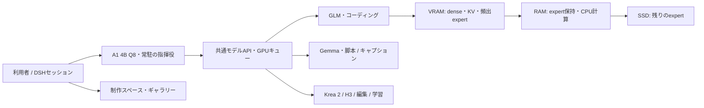

# Mang-AI

A1を指揮役に、ローカルモデルで漫画・画像・動画・コードを制作する環境です。DeepSeek Harness（DSH）のセッションに作品と編集履歴を結び付け、脚本、作画、吹き出し、日本語文字、画像補完、モザイク、LoRA学習を扱います。GLMはコーディングを担当します。

**現状は個人ワークステーションで検証した開発版です。** ソースをcloneしただけではモデルやGPU環境は揃いません。確認済みの機能と未検証の品質・性能を以下に分けて記載しています。

| 目的 | 入口 |
|---|---|
| 画面の使い方・制作機能 | [制作ツールREADME](manga-studio/README.md) |
| A1とGPUモデルの導入 | [常駐モデルの設定](manga-studio/docs/resident-model-setup.md) |
| GLMの導入・保持・切替 | [GLMコーディング](manga-studio/docs/glm-coding-session.md) |
| Codex・Devinの複数アカウント、DeepSeek API | [セッション別の担当・モデル・残量表示](manga-studio/docs/ai-accounts.md) |
| 262K入力の測定値・制約 | [GLM検証結果](manga-studio/docs/glm-validation-2026-10-09.md) |
| AVIF・LoRA・学習データの保管と復元 | [保存・再導入手順](manga-studio/docs/training-assets.md) |
| 画像収集とA1連携 | [X・Pixiv・Gelbooru・Pawchive](manga-studio/docs/dataset-collection.md) |
| モデル・LoRAの参考画像 | [サムネイルの設定・変更](manga-studio/docs/model-thumbnails.md) |
| 会話と生成物を一緒に扱う | [セッションとメディア](manga-studio/docs/session-workspace.md) |
| 生成情報の保存・投稿時の削除・進捗 | [EXIFと投稿用コピー](manga-studio/docs/generation-metadata.md) |
| 自分の端末から外部接続 | [Cloudflare Tunnel・メールPIN／Google認証](manga-studio/docs/remote-access.md) |
| 外部環境の取得元・固定版 | [integrations](integrations/README.md) |
| 小説執筆の規約・Skill | [小説執筆ガイド](docs/novel-writing.md)、[MANUAL](MANUAL.md) |
| 検証資料の一覧 | [ドキュメント索引](docs/README.md) |

## 構成



A1は常駐し、大きなGPU工程はキューで調整します。GLMは必要時に起動し、応答後600秒保持します。別工程が待つと、現在の生成を終えてから解放します。会話はクライアントが送り、A1とGLMのKVキャッシュは共有しません。

Codex / Devinを使う場合は、[AIアカウント設定](manga-studio/docs/ai-accounts.md)で登録し、セッションごとにアカウントとモデルを選びます。A1からの依頼と担当パネルからの直接依頼に対応し、残り使用量・リセット時刻は進捗の上に表示します。DeepSeek APIキーも登録できます。ネイティブCLIの認証情報は登録枠ごとに分離し、Gitへ含めません。

| 役割 | 構成 |
|---|---|
| 指揮・ツール操作 | Agents A1 4B Q8、API `127.0.0.1:1240` |
| コーディング | OrcaRouter GLM-5.3-Flash Uncensored Q4_K_M、[Strata-GLM](https://github.com/daraskme/Strata-GLM)、内部API `1243` |
| 共通API | OpenAI Chat Completions互換、`http://127.0.0.1:1234/v1` |
| 創作・認識 | Ortenzya 31B / UNSEEN Gemma、工程別に切替 |
| 作画・動画 | Krea 2 / MiniMax H3。文字は別レイヤーで編集 |

## 導入

確認環境は **NixOS、i9-12900KS、DDR4-3200 128 GiB、RTX PRO 6000 Blackwell 96 GB、NVMe SSD**。GLMはCUDA 13 / sm_120でビルドしました。下記の軽量試験にはGPUやモデルは不要ですが、実制作には各モデル・バックエンドが必要です。

```bash
git clone https://github.com/daraskme/Mang-AI.git
cd Mang-AI/manga-studio
npm ci
# NixOSでプロジェクト内のNodeを初めて準備する場合
node scripts/prepare-nixos.mjs
```

DSHの実行には依存として固定した **Node 24.13.0** を使います。システムNode 24.20.0ではnative loaderの起動エラーを確認しました。Nodeの一般的な最低バージョン条件だけでは互換性を保証しません。

モデル接続は[設定例](manga-studio/studio.config.example.json)と[導入手順](manga-studio/docs/resident-model-setup.md)に従います。GLMのソースは別リポジトリで、[固定コミット](integrations/strata-glm.json)から復元・ビルドします。重みとpackは別途取得・作成してください。GLMのGGUFだけで約179.72 GiBあり、pack・ビルド・他モデル分の空きSSDも必要です。

準備後、`manga-studio/`から起動します。

```bash
node_modules/node/bin/node scripts/launch.mjs
```

GUIのURLは起動時に表示されます。ローカル用の認証URLをREADME・ログ・Gitへ貼らないでください。`/mnt/solidigm-b/Mang-AI`や`/etc/nixos#cuda`が過去資料に出る場合は測定PC固有の場所です。後者のNix flakeはこのリポジトリに含まれません。

## GLMの検証結果（2026-10-09）

**262144のコンテキスト枠で、実入力260090 tokensから3位置の検索に成功しました。生成は17.1 tokens/sで、目標50 tokens/sには届いていません。元FP8モデルとの品質同等性も未検証です。**

| 実入力 / 生成 | prefill（入力処理） | decode（生成） | 検索 |
|---|---:|---:|---|
| 8180 / 512 tokens | 9.77秒、837.4 tokens/s | 15.9 tokens/s | 3/3 |
| 260090 / 512 tokens | 426.49秒、609.8 tokens/s | 17.1 tokens/s | 3/3 |

prefix再利用は0。長文のHTTP全体は457秒、モデルの初期ロード約70秒は別です。これは合言葉検索と512-token生成の試験で、生成コードの完成・実行正答率を示しません。

| 262K試験のメモリ | 実測 |
|---|---:|
| GPU dense / KV・state / expert pool | 5.34 / 8.74 / 63.13 GiB |
| expert RAM tier | 94.98 GiB（固定予算の比較試験） |
| GPU総使用量の最大 | 88.44 GiB（A1・画面等を含む） |
| 空きRAM / VRAMの最小 | 12.62 / 7.15 GiB |

通常設定はcontext 262144、RAM headroom 16 GiB、CPU 8 workers・自動分担、先読み0です。可変予算でRAM tier 93.96 GiBを観測しましたが、17.1 tokens/sは固定94.98 GiBの試験値です。通常設定では共通API経由の日本語一致、clampの8入力、tool JSONの3検査を通しました。

### 注意点

- **262144は入力と出力の合計枠。** 最大出力16384を全て確保すると、入力・template・toolに使える枠は245760以下です。登録スクリプトの既定は131072なので、262144を明示します。
- 長文試験でシステム全体のzram swap-outが約944 MiB増加しました。RAM headroomは予算計算上の余裕であり、常時空きRAMの保証ではありません。
- UEFI変更後、負荷中のPCIe Gen5 x16を確認。アイドル時のGen1表示だけでは異常とは判断できません。DMA測定と実際のhost-mapped転送の速度は異なります。
- Q4_K_Mの重みを使用しており、独自の再量子化、単一GPUのMTP、DMAへのランタイム変更は未実装です。先読みやCPU固定配分は一律改善せず、通常設定に採用していません。
- A1のhealth維持は確認しましたが、重い指揮タスクのp95遅延は未測定です。長文試験ではGPU温度最大89℃を観測しました。電力・冷却設定は変更していません。
- 推論APIはlocalhost用です。GUIの外部接続には別途[Cloudflare Access付きTunnel](manga-studio/docs/remote-access.md)を設定します。モデルの`tool_choice=required`強制は未対応です。
- H3の新規LoRA学習、吹き出しの自動検出・文字の自動フィット等は未実装です。作画・学習の確認範囲は[機能監査](manga-studio/docs/feature-audit-2026-10-05.md)と[実生成確認](manga-studio/docs/lora-generation-validation-2026-10-08.md)を参照してください。

条件別の全測定、採否、再現方法、残る評価計画は[詳細なGLM検証](manga-studio/docs/glm-validation-2026-10-09.md)にまとめています。

## 開発・検査

Python検査にはPillow（AVIF対応）、動画メタデータの検査にはffmpeg/ffprobeが必要です。導入済み環境では `caption-studio/runtime/python-run` を使えます。

```bash
# manga-studio/で実行。いずれも実モデルの起動は不要
node_modules/node/bin/node --test tests/*.test.js
TEST_PYTHON=/absolute/path/to/python3 node_modules/node/bin/node tests/dsh-smoke.mjs
cd ..
python3 -m unittest discover -s manga-studio/tests -p 'test_*.py'
python3 scripts/audit-repo.py
```

2026-10-09の追加検査ではNode 45件、Python 27件、Caption Studio 15件、H3進捗・ジョブ管理10件と、実DSH＋模擬APIの統合試験が成功。独立したDSHの実ブラウザで会話の参照素材・下書き保持・生成画面・モバイル幅を確認しました。GLM側のPython検査は15件です。これらは実モデル品質の検証を代替しません。小説の表記ルールを変更する場合は追加で`bash scripts/eval.sh`を実行します。

AIアカウント機能追加後はNode 51件、Devin残量解析・本人確認情報の保持4件、アカウント画面・実DSH画面のブラウザ試験とDSH統合試験が成功しました。Devinの2登録アカウントでOpus 5.5の短い実応答と残量取得、Codexの複数ログインと1アカウントでの短い実応答を確認しています。ファイルを操作する実際のコーディング作業はこの確認に含みません。[検証範囲・注意点](manga-studio/docs/ai-accounts.md)

## 画像・LoRA・データの実施結果

- 32個の登録済みLoRAを含む学習資産と、画像・キャプション・動画を別々の非公開Hugging Faceリポジトリへ保管し、SHA-256を照合しました。基本モデルは公式の固定版から復元します。
- 静止画8,048枚をAVIFへ変換。長辺2048を超える2,492枚だけ縮小し、画像群は17.3953 GiBから3.9617 GiBへ77.23%削減しました。原本と動画は再圧縮せず保持しています。再学習ではキャッシュを再作成します。
- Krea2 24個・H3 8個すべてで新しく生成し、実出力からサムネイルを設定しました。Krea2は海と水着の成人女性、各LoRAのトリガーを使用。H3は新規生成動画の先頭フレームです。
- X・Pixiv・Gelbooru・Pawchiveの収集とAVIF準備をA1のツールから実行できます。認証が必要な実サイトでの収集は未検証です。H3の新規LoRA学習は引き続き未統合です。

## リポジトリの役割

| 場所 | 内容 |
|---|---|
| `manga-studio/` | GUI、DSHプラグイン、GPUキュー、モデル管理、試験 |
| `integrations/` | 外部コードの固定版・差分・復元情報 |
| `docs/` | 資料索引、小説ガイド、公開物の扱い |
| `guidelines/`、`.agents/skills/`、`templates/` | 小説の規約・手順・雛形 |
| `scripts/`、`tests/` | 小説環境の初期化・監査・回帰試験 |
| `upstream/`、`models/`、`work/`、`secrets/` | 各PCのローカルデータ。Git対象外 |

モデル重み、作品、会話、認証情報、仮想環境、大容量の実行ログは配布物に含めません。公開する検証JSONと人工的な評価用入力は推論エンジン側へまとめています。[公開物の方針](docs/publication.md)も参照してください。

## 利用条件・謝辞

同梱の小説執筆パッケージは[LICENSE](LICENSE)に従います。第三者コード・モデル・サービスにはそれぞれの利用条件が適用されます。リポジトリの公開を、全構成要素に対する新しい一括ライセンスの付与とは扱いません。

GLMエンジンは[Project Maya](https://github.com/mw00/project-maya) / [Strata](https://github.com/Niko1221/Strata)を継承し、元のMIT表示を維持しています。源暎アンチックは[OFL表示](manga-studio/docs/third-party-fonts.md)とともに同梱しています。各モデルの取得・再利用条件は配布元で確認してください。
